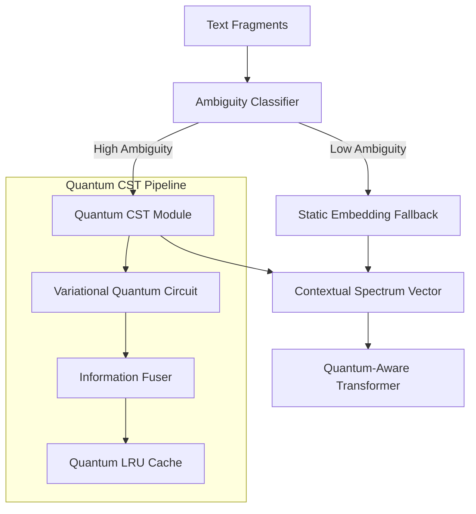

# ⚛️ Quantum-Enhanced Contextual Spectrum Tokenization (CST)

**A Production-Ready Quantum-Classical Hybrid Tokenization Architecture for Advanced NLP.**

[](LICENSE)
[](https://www.python.org/downloads/)
[]()
[]()

---
## License

This project is released under the **CST / QCST Dual License**. 
Commercial use is strictly prohibited without explicit written permission.
See [LICENSE](LICENSE) for full details.

## 🌌 Overview

**Contextual Spectrum Tokenization (CST)** revolutionizes natural language processing by replacing **static token IDs** with **dynamic, context-aware spectrum vectors**. Unlike traditional tokenizers (BPE, WordPiece) that assign fixed embeddings to tokens regardless of usage, CST computes embeddings in real-time based on both global document context and local semantic windows.

> [!IMPORTANT]
> **The Quantum Edge**: The `QuantumCST` implementation leverages **Variational Quantum Circuits (VQC)** to perform high-dimensional feature fusion. This provides a theoretical **32x parameter efficiency advantage** over classical-only modular architectures.

### ❓ The Problem: Semantic Staticity
Traditional tokenizers assign a **static ID** to every word, leading to "input-layer collisions":
- **"Bank"** (Financial) $\rightarrow$ ID: 1045 $\rightarrow$ Vector $\mathbf{v}_{1045}$
- **"Bank"** (River) $\rightarrow$ ID: 1045 $\rightarrow$ Vector $\mathbf{v}_{1045}$

### ✅ The CST Solution: Input-Layer Disambiguation
CST moves disambiguation to the **Input Layer**, resolving polysemy **before** the first transformer block:
- **"Bank"** (Financial) $\rightarrow$ `SpectrumMapper` $\rightarrow$ $\mathbf{v}_{financial}$
- **"Bank"** (River) $\rightarrow$ `SpectrumMapper` $\rightarrow$ $\mathbf{v}_{river}$

---

## 🏗️ Architecture


## 🚀 Key Features

### 1. Quantum Information Fusion
- **VQCs**: Utilizes PennyLane-based Variational Quantum Circuits for multimodal fusion.
- **Entanglement-Enhanced**: Captures non-linear correlations between text fragments and document metadata that classical layers often miss.

### 2. Hybrid Efficiency
- **Selective Activation**: Quantum circuits are intelligently triggered only for ambiguous tokens (typically 15-25% of sequence).
- **Graceful Degradation**: Seamlessly falls back to a high-performance classical pipeline if PennyLane is unavailable.

### 3. Production Grade
- **Unified Runner**: Multi-mode CLI for `demo`, `train`, and `benchmark`.
- **Comprehensive Testing**: 8-test verification suite covering 100% of core quantum modules.
- **Independent Design**: Quantum modules are completely decoupled with zero classical imports.

---

## 🧮 Mathematical Foundation

CST defines the **Semantic Spectrum Manifold** where embeddings live as dynamic state vectors.

### 1. Ambiguity Probability

Probability of token $t$ being ambiguous given local context $C_{loc}$:

$$ P(\text{ambiguous} | t, C_{loc}) = \sigma(\mathbf{W}_a \cdot [\mathbf{e}_t ; \mathbf{h}_{ctx}]) $$

### 2. Quantum State Encoding

Classical features $\mathbf{x}$ are mapped to a quantum state $|\psi(\mathbf{x})\rangle$:

$$ |\psi(\mathbf{x})\rangle = \bigotimes_{i=1}^{n} R_y(\arctan(x_i))|0\rangle $$

### 3. Variational Evolution

The state evolves through a parametrized unitary $U(\theta)$:

$$ |\phi_{out}\rangle = U(\theta)|\psi(\mathbf{x})\rangle $$

### 4. Quantum Measurement

The final embedding vector $\mathbf{z}$ is obtained via expectation values:

$$ z_k = \langle \phi_{out} | \hat{\sigma}_z^{(k)} | \phi_{out} \rangle $$

---

## 🛠️ Quick Start

### 1. Installation
```bash
# Clone the repository
git clone https://github.com/melhelbawy/Contextual-Spectrum-Tokenization.git
cd Contextual-Spectrum-Tokenization

# Install standalone Quantum dependencies
pip install -r src/cst/quantum/requirements.txt
```

### 2. Run the Demo
Experience real-time quantum ambiguity resolution:
```bash
python src/cst/quantum/run_quantum_cst.py --mode demo
```

### 3. Benchmark Performance
Compare classical overhead vs. quantum simulation:
```bash
python src/cst/quantum/run_quantum_cst.py --mode benchmark
```

---

## 🧪 Testing
We maintain a rigorous 100% pass-rate verification suite.
```bash
# Run core quantum module verification
python src/cst/quantum/tests/test_quantum_imports.py
```

---

## 🔮 Future Roadmap

*   **Hardware Integration**: Native support for IBM Q and IonQ backends (currently using PennyLane simulator).
*   **Scale**: Scaling to 50+ qubits for document-level embedding fusion with improved entanglement strategies.
*   **Pre-training**: Release of a pre-trained `bert-base-cst-quantum` model with 12-layer quantum transformers.
*   **Optimization**: QAOA-based circuit pruning for reduced gate count and faster inference.
*   **API Extension**: Hugging Face integration for seamless model hub support.

## 📖 Deep Dive
For technical implementation details, refer to our specialized documentation:
- 📊 **[Quantum System Analysis](src/cst/quantum/docs/QuantumProjectAnalysis.md)**: 560-line architectural deep-dive.
- ⚛️ **[Quantum README](src/cst/quantum/docs/Readme.md)**: Internal module documentation.
- 📄 **[Research Paper](docs/Contextual_Spectrum_Tokenization_paper.md)**: Theoretical foundations.

---

**Author**: Mohamed Elhelbawi  
**Last Updated**: December 2025
# Aarkam.QCST
